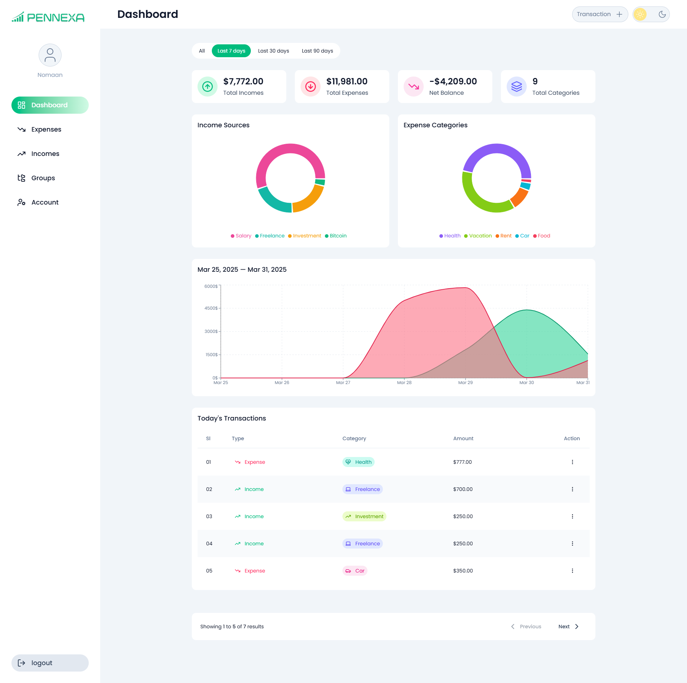
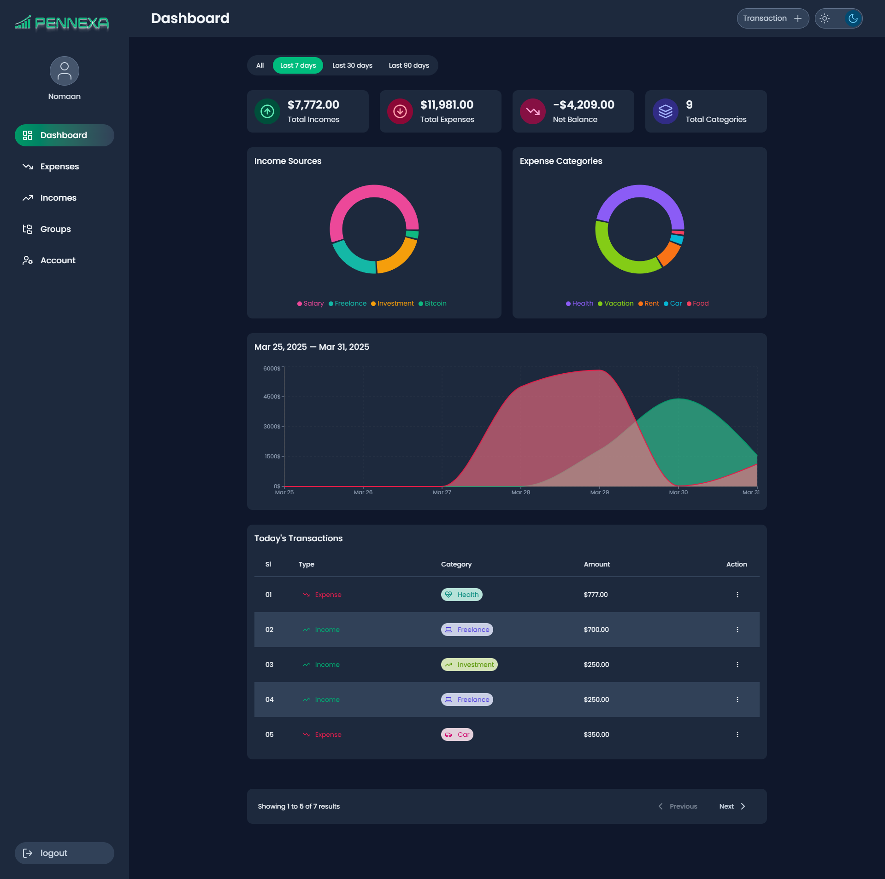
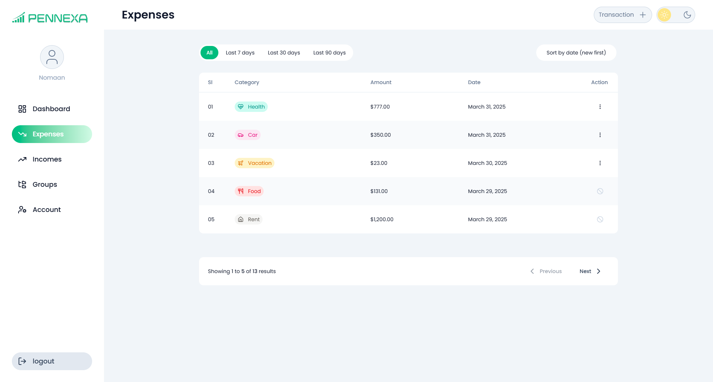
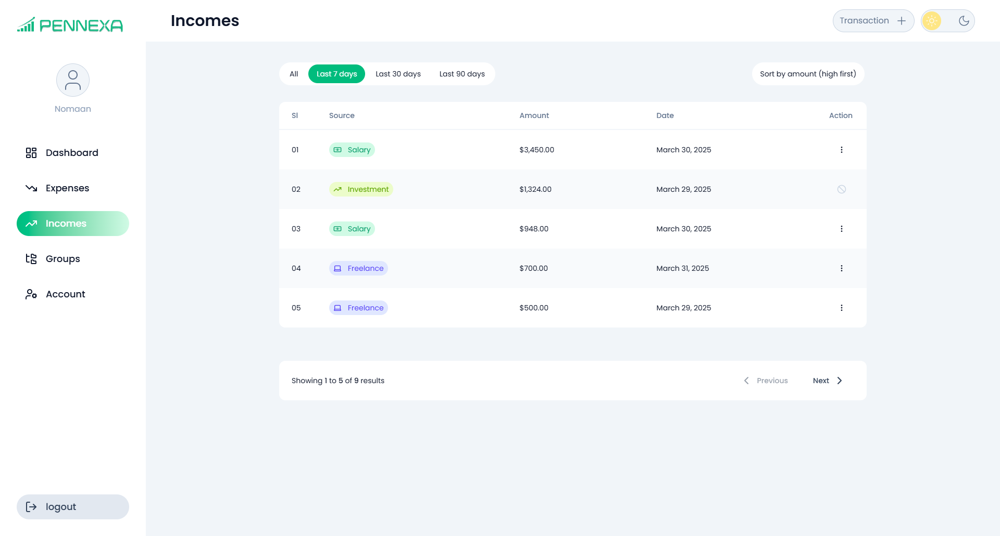
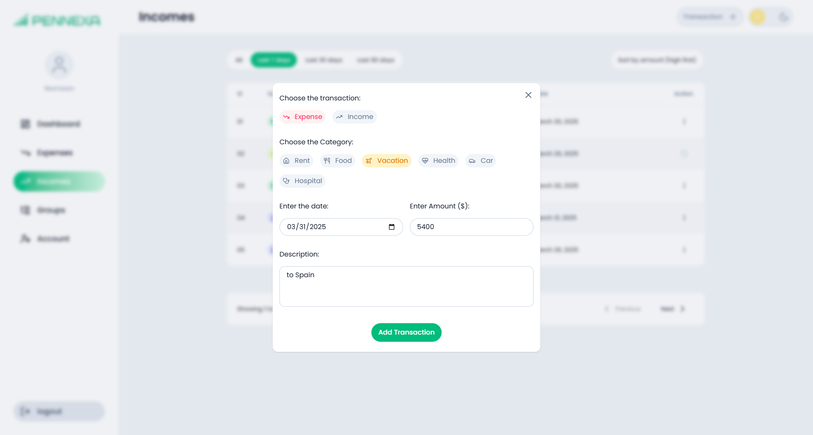
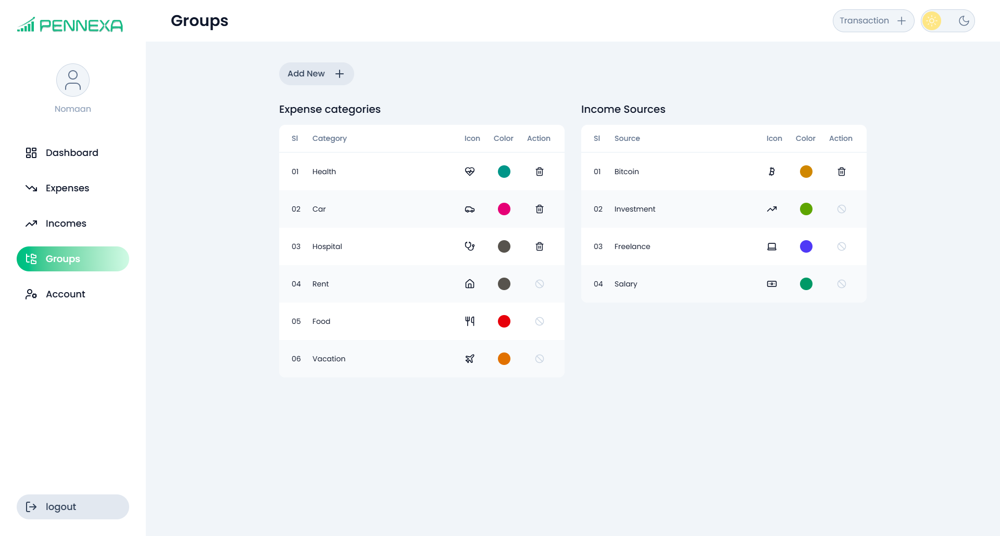
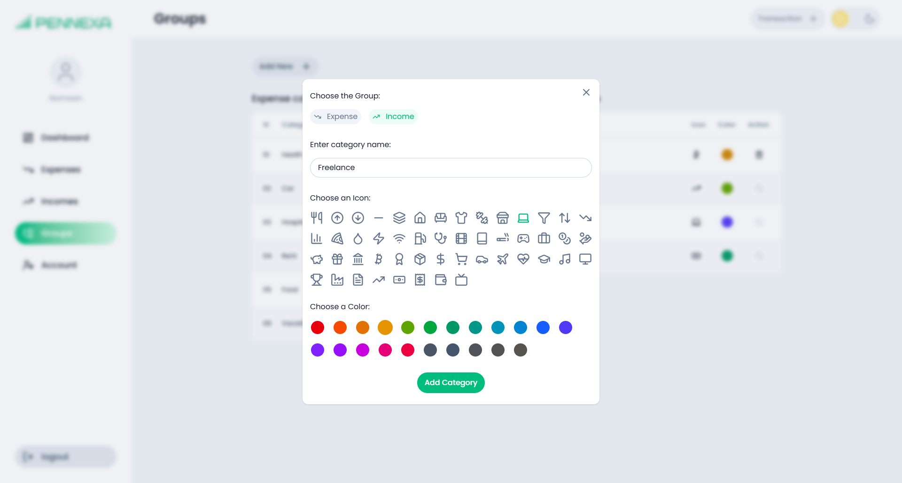
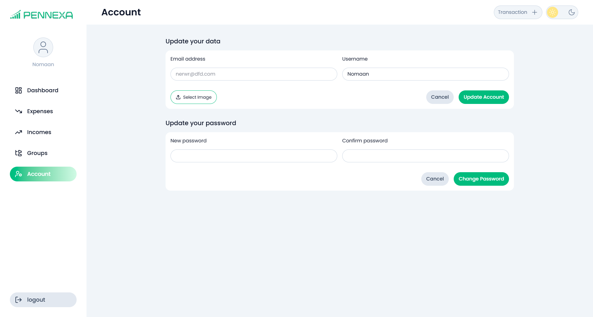
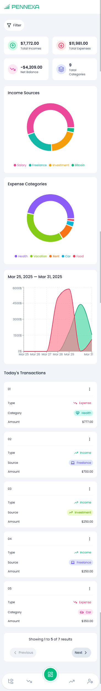

#  Pennexa

[](LICENSE)


**Pennexa** is a modern **Personal Finance Dashboard** that helps users track their income and expenses effortlessly, with powerful analytics and real-time insights.

▶ **Live Demo:** [Pennexa](https://nomaan-07.github.io/Pennexa)  
📱 Fully optimized for all devices: mobile, tablet, and desktop.



---

## ✨ Features

### 📊 Financial Overview

| Feature            | Description                                            |
| ------------------ | ------------------------------------------------------ |
| **Summary**        | Real-time income and expense calculation               |
| **Dynamic Charts** | Pie charts (categories/sources) + Area charts (trends) |
| **Smart Filters**  | Toggle between All/7/30/90-day views                   |

### 🔄 Transaction Management

| Feature             | Description                                |
| ------------------- | ------------------------------------------ |
| **CRUD Operations** | Add/edit/delete incomes & expenses         |
| **Smart Tables**    | Sort by name/amount + pagination + filters |
| **Quick Add**       | Floating action button for new entries     |

### 🎨 Customization

| Feature              | Description                           |
| -------------------- | ------------------------------------- |
| **Dark/Light Mode**  | Manual toggle                         |
| **Custom Groups**    | Create categories with icons & colors |
| **Profile Settings** | Update avatar, username, password     |

---

## 🛠 Tech Stack

### Frontend

| Technology          | Usage                 | Version  |
| ------------------- | --------------------- | -------- |
| **React 19**        | Core framework        | v19.0.0  |
| **Tailwind CSS**    | Styling + Dark mode   | v4.0.15  |
| **React Query**     | Data fetching/caching | v5.69.0  |
| **React Hook Form** | Form management       | v7.54.2  |
| **Recharts**        | Data visualization    | v2.15.1  |
| **React Router**    | Navigation            | v7.4.0   |
| **date-fns**        | Date formatting       | v4.1.0   |
| **Lucide React**    | Icons                 | v0.483.0 |

### Backend

| Technology             | Usage                        | Version    |
| ---------------------- | ---------------------------- | ---------- |
| **Supabase Auth**      | Secure authentication        | JS v2.49.3 |
| **Supabase Database**  | PostgreSQL-powered database  | JS v2.49.3 |
| **Row Level Security** | Fine-grained access control  | Built-in   |
| **Supabase Storage**   | Upload and manage user files | Built-in   |

---

## 📸 Screenshots

### Dashboard Views

| Light Mode                                                 | Dark Mode                                                |
| ---------------------------------------------------------- | -------------------------------------------------------- |
|  |  |

### Key Features

| Feature                | Preview                                                    |
| ---------------------- | ---------------------------------------------------------- |
| **Expense Table**      |      |
| **Income Table**       |        |
| **Add Transaction**    |  |
| **Groups Table**       |        |
| **Add Group**          |              |
| **Account Management** |                  |
| **Mobile View**        |               |

---

## 🚀 Getting Started

### Prerequisites

- Node.js ≥18.x
- Supabase account

### Installation

1. Clone the repository:

   ```bash
   git clone https://github.com/nomaan-07/Pennexa.git
   ```

2. Install dependencies:

   ```bash
   npm install
   ```

3. Set up environment variables:

   ```env
   # Create a .env file in the root directory and add your Supabase credentials:
   VITE_SUPABASE_URL=your-project-url
   VITE_SUPABASE_ANON_KEY=your-anon-key
   ```

4. Run development server:
   ```bash
   npm run dev  # Start the development server
   ```

---

## 🤝 Contributing

We welcome contributions! Here’s how to get started:

1. **Fork** the project
2. **Create** a feature branch (`git checkout -b feature/AmazingFeature`)
3. **Commit** your changes (`git commit -m 'Add amazing feature'`)
4. **Push** to your branch (`git push origin feature/AmazingFeature`)
5. **Open a Pull Request** 🎉

🚀 **Looking for an easy way to contribute?**  
Check out [Good First Issues](https://github.com/nomaan-07/Pennexa/issues) to find beginner-friendly tasks.

---

## 📜 License

Distributed under the **MIT License**. See [MIT License](LICENSE) for details.

---

## 💌 Contact

Nomaan Rigi
📧 nomaan07.dev@gmail.com

<p align="center"> Built with ❤️ using React by Nomaan Rigi. </p>

---

## 🔮 Roadmap

- [ ] Recurring transactions
- [ ] CSV export/import
- [ ] Multi-account support
- [ ] Budget planning tools

---
